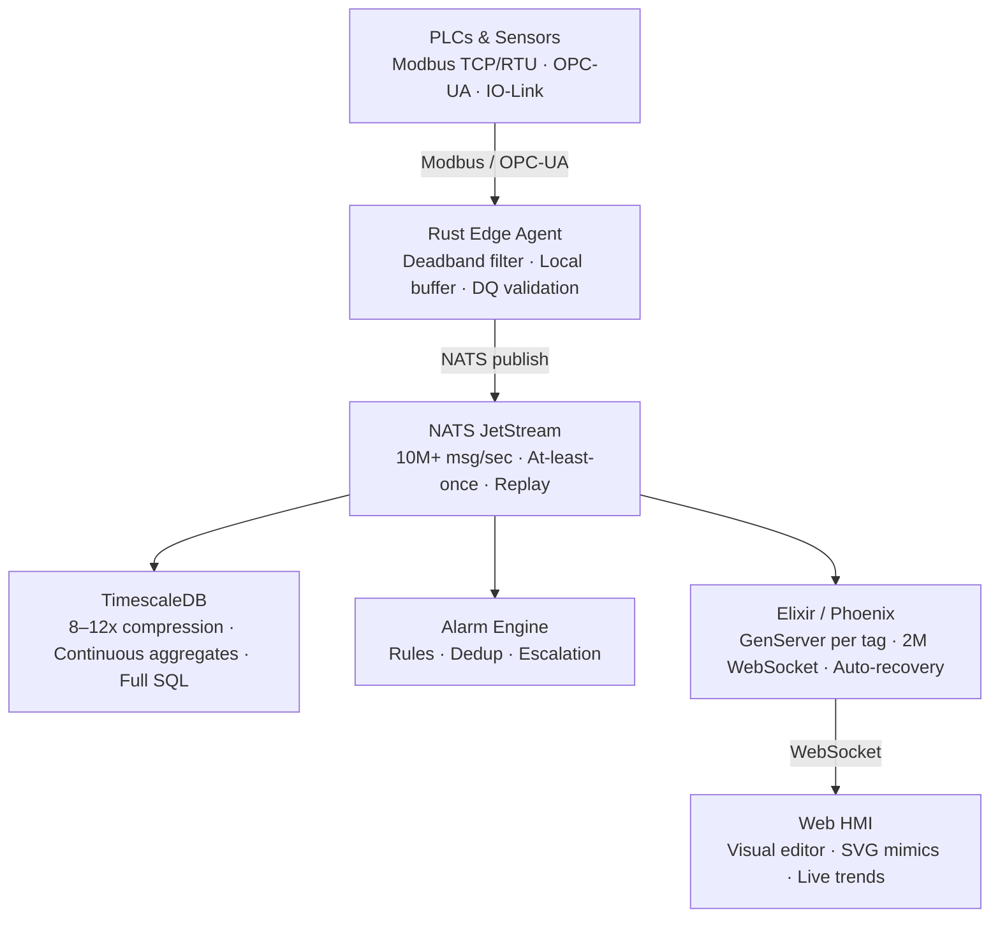

# IRON

**A new philosophy for industrial automation.**

> Industrial software has not meaningfully evolved in 30 years.
> IRON is a rethinking — not an improvement — of how modern factories
> should be built, controlled, and understood.

[](LICENSE)
[]()
[](CONTRIBUTING.md)

---

## The Problem

Walk into any industrial plant today and you will find:

- A SCADA system running on Windows XP because the vendor's driver only supports it
- An HMI built with tools from 1998, with a UX that has not changed since
- No version control — configuration lives in binary files on a single machine
- A historian database that takes 3 minutes to return a 7-day trend
- A $200,000 invoice for software that does less than a modern web application
- Zero separation between reading sensor data and sending commands to machines

This is not a niche problem. This is the global standard.

The world's factories run on software that would be unacceptable in any other domain.
We accept it because "that's how industrial software works."

**IRON rejects this premise.**

---

## The Vision

A factory should be as observable, reliable, and maintainable as the best software systems in the world. Not "good for industrial software." Good by absolute standards.

This means:
- Every configuration change tracked in Git with author, timestamp, and reason
- A developer productive on day one — without learning a proprietary tool
- An automation engineer productive on day one — without learning React
- Sensor data visible in a browser anywhere in the world in under 100ms
- A hardware failure that triggers automatic recovery, not a 3am phone call
- A system that costs $20,000 to deploy, not $200,000

IRON is the architectural blueprint for this factory.

---

## Five Principles

### I. The READ and WRITE paths are sacred

A visualization bug must be physically incapable of sending a command to a machine. This is not a feature. It is a non-negotiable constraint that every component is designed around.

```
READ:   Sensors → Edge → Broker → Storage → UI
        (one direction, always, no exceptions)

WRITE:  Operator → Auth → Audit Log → Command Service → Edge → Machine
        (explicit, authorized, fully logged, confirmed)
```

### II. Intelligence belongs at the edge

The agent next to the PLC is not a relay. It validates, filters, buffers, and protects. When the network goes down — it keeps working. When it comes back — no data was lost. When a sensor fails — the system knows, it does not guess.

### III. One database, not a zoo

Configuration, time-series, alarms, users, permissions — one engine, one query language, one backup. TimescaleDB is PostgreSQL. Everything you already know applies. Cross-domain JOINs in a single query. No synchronization between systems.

### IV. The developer and the engineer are equal

The automation engineer with 20 years of PLC experience who knows nothing about React is not less valuable than the developer who knows Rust and nothing about Modbus. IRON serves both. Three levels of entry, one underlying system.

### V. Open is not optional

Industrial software that is closed-source, licensed per tag, and requires a certified partner for installation is not just expensive — it is fragile. When the vendor raises prices or goes bankrupt, the factory is hostage. IRON is MIT-licensed. Fork it. Own it. Run it forever.

---

## Architecture



---

## Technology Stack

| Layer | Technology | Why |
|---|---|---|
| **Edge Agent** | Rust | No GC pauses, memory safety, single binary, native ARM/x86 |
| **Message Broker** | NATS JetStream | Single binary, 30MB RAM, at-least-once, hierarchical topics |
| **Time-Series DB** | TimescaleDB | PostgreSQL-compatible + 8–12x compression + continuous aggregates |
| **Backend** | Elixir / Phoenix | Erlang VM: GenServer per tag, 2M WebSocket connections, supervision trees |
| **Frontend** | Phoenix LiveView + React island | LiveView handles 90% (real-time UI, state sync, WebSocket); React for SVG mimic editor only |
| **PLC Programming** | CODESYS / TwinCAT 3 | IEC 61131-3 ST, Git-friendly, VS Code integration |

---

## Scaling to 100,000 Tags

A mid-size refinery has 100,000 tags updating every second. Three layers make this tractable:

```
100,000 polls/sec
  → deadband filter (Rust)     → ~10,000 publishes/sec  (−90%)
  → GenServer routing (Elixir) → subscribers only
  → client subscription        → 50–200 updates/sec per browser
```

An operator viewing a pump station screen receives updates for the 50–200 tags on that screen. Not 100,000. This is the difference between correct and naive architecture.

---

## Developer Experience

```bash
# Create a new process object — generates all scaffolding
iron generate object reactor_01

# Add a tag
iron tag add reactor_01.temperature \
  --source modbus://plc-01/holding/0x1000 \
  --type float32 --unit "°C" --deadband 0.5

# Simulate without real hardware
iron simulate reactor_01 --temperature "sine:20:180:60s"

# Validate configuration
iron validate
# ✅ 47 tags valid
# ⚠️  reactor_01.flow — no alarm limits defined
# ❌ pump_02.status — source unreachable

# Deploy to edge device
iron deploy --target edge-01
# Compiling Rust agent... done
# Uploading config... done
# ✅ 47 tags active, real data flowing
```

The simulator is not a convenience — it is a philosophy. A developer should never need physical access to a PLC to build and test a screen. This alone cuts development time by half.

---

## Why This Has Not Been Built Yet

The pieces exist. NATS, TimescaleDB, Elixir, Rust — all mature and production-proven. The Unified Namespace movement evangelizes the broker-centric approach. Factry Historian uses TimescaleDB. Ignition proved SCADA can be web-based.

Nobody has assembled it into one cohesive, open, deployable system. Why?

**The cultural gap.** People who understand OT — PLC scan cycles, Modbus edge cases, why you cannot run Nmap in a production plant — rarely know modern software architecture. People who know Rust and Elixir rarely have factory floor experience. IRON requires both. That intersection is small.

**Conservative buyers are rational.** A plant that runs is not touched. The entry point is greenfield projects and forward-thinking integrators.

**Incumbents have no incentive.** Siemens, Rockwell, and Schneider profit from vendor lock-in. They will not build this.

**The market is ready.** NIS2 in Europe mandates OT cybersecurity. CIS markets want data sovereignty. A generation of automation engineers is retiring and being replaced by people who expect Git and a CLI.

**The window is open.**

---

## Roadmap

```
Phase 1 — Foundation    (months 1–4)   Rust agent · NATS · TimescaleDB · Phoenix
Phase 2 — Interface     (months 5–7)   Visual editor · 20+ widgets · Alarm engine
Phase 3 — Production    (months 8–11)  HA failover · Security audit · Beta
Phase 4 — Ecosystem     (months 12–18) IEC 62443 · Partner program · v1.0
```

---

## Economic Impact

Each percentage point of OEE (Overall Equipment Effectiveness) at a $15M/year plant represents ~$120k in additional profit. Modern SCADA with real-time visibility and predictive analytics contributes +5–15% OEE. Payback period: 3–6 months.

Traditional SCADA deployment: $150–300k, 18–24 months payback.
IRON deployment: $20–50k, 3–6 months payback.

The ROI argument is not subtle. See [Economic Impact](docs/economics.md).

---

## Target Markets

**CIS industrial SMEs** — Kazakhstan, Uzbekistan, and broader CIS region. Ignition has minimal presence. Siemens is expensive. Data sovereignty concerns make self-hosted solutions attractive. Local domain expertise is a genuine competitive moat.

**Greenfield industrial projects** — new plants without legacy to protect.

**System integrators** — ready to offer a modern alternative with better margins and faster deployment.

---

## RFCs

Architecture decisions, philosophy, and business model are documented as RFCs:

| RFC | Title | Summary |
|---|---|---|
| [0001](rfcs/0001-vision.md) | Vision | What IRON is, why it exists, what winning looks like |
| [0002](rfcs/0002-architecture.md) | Architecture | iron-core, iron-web, edge deployment, protocol roadmap |
| [0003](rfcs/0003-dx-philosophy.md) | DX Philosophy | `iron new`, 5 minutes to first dashboard, DX manifesto |
| [0004](rfcs/0004-business-model.md) | Business Model | Open core tiers, pricing philosophy, IndustrialPROFI |

---

## Contributing

IRON is in the concept phase. The most valuable contributions right now are not pull requests — they are conversations.

- **Challenge the architecture** — open an Issue, argue a better approach
- **Share domain expertise** — what does this get wrong from your factory floor experience?
- **Build a proof of concept** — any single component implemented and tested
- **Spread the idea** — if this resonates with you, share it with someone it might resonate with too

See [CONTRIBUTING.md](CONTRIBUTING.md).

---

## License

MIT — own it, fork it, deploy it, build a business on it.

---

*IRON is a concept born from a simple belief: the tools to build better industrial software finally exist. Someone just needs to put them together.*

*If you share that belief — welcome.*
