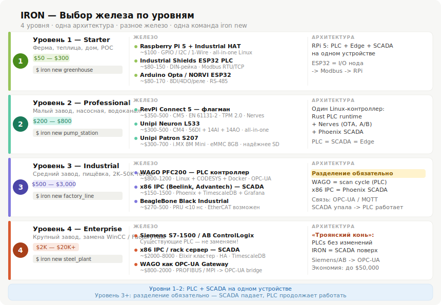

# Hardware Selection Guide



> Interactive diagram: [Hardware Tiers by Level](assets/hardware-tiers.html)
> Open in a browser — supports light and dark mode.

Choosing hardware for industrial automation is not a question of budget alone —
it is a question of architecture. The wrong device at the wrong level creates
problems that no amount of software can fix.

This guide organises hardware selection by deployment level.
Each level has a different answer to the same question:
**what runs where, and what happens if it fails?**

---

## The Core Architectural Decision: PLC/SCADA Separation

This is the most important decision in hardware selection, and it changes
depending on plant size.

```
Levels 1–2: Everything on one device
──────────────────────────────────────────────────────────────────
  RevPi Connect 5 or Unipi Neuron
  │
  ├── Rust PLC runtime (scan cycle, I/O control)
  ├── iron-core edge agent (data collection, NATS publish)
  └── iron-web Phoenix SCADA (LiveView, historian, alarms)

  Like Rails development mode: everything in one process.
  Fast to set up. Sufficient for small plants.

Level 3+: Mandatory separation
──────────────────────────────────────────────────────────────────
  WAGO PFC200 / RevPi + I/O modules          x86 IPC (separate)
  ──────────────────────────────             ──────────────────
  Scan cycle: 1–10ms                         Phoenix SCADA
  I/O control                    OPC-UA      TimescaleDB
  Safety logic                 or MQTT       Grafana dashboards
  Autonomous operation     ──────────►       Alarm management
  (continues if SCADA down)                  Remote access
```

**Why separation is mandatory at Level 3:**
If the SCADA server crashes, the PLC must keep the plant running.
This is not a preference — it is the reliability contract that every
serious industrial plant demands. A SCADA process running on the same
CPU as the scan cycle violates this contract.

---

## Level 1 — DIY / Maker / Small Farm

**Use case:** Greenhouse with 10–40 sensors, irrigation control, home automation,
proof of concept, developer learning IRON.

**Budget:** $150–400

### Recommended: Raspberry Pi 4/5 + ESP32 I/O nodes

```
Raspberry Pi 4 (4GB) in industrial enclosure
  ├── iron-core (Rust): reads Modbus from ESP32 nodes
  ├── iron-web (Phoenix): LiveView dashboard on phone
  └── TimescaleDB: historian on SD card (or USB SSD)

ESP32 PLC nodes (one per zone)
  ├── Industrial Shields ESP32 PLC (~$80–150, DIN-rail)
  └── Modbus RTU → Raspberry Pi master
```

**Farm with 5 greenhouses:**
```
Raspberry Pi in server room    ← brain, IRON
    │
    ├── ESP32 PLC Greenhouse 1  ← temperature, humidity, relay
    ├── ESP32 PLC Greenhouse 2
    ├── ESP32 PLC Greenhouse 3
    ├── ESP32 PLC Greenhouse 4
    └── ESP32 PLC Greenhouse 5

Total cost: $700–1,000
Equivalent Siemens solution: $5,000+
```

**Limitation:** Raspberry Pi with SD card is not production-grade.
Use USB SSD for TimescaleDB storage. Step up to Level 2 for serious deployments.

---

## Level 2 — Professional Small Plant

**Use case:** Greenhouse business, small factory, pump station, water treatment
with 40–2,000 tags. Single device handles PLC + SCADA.
Production deployment, but small enough that one device is acceptable.

**Budget:** $300–800

### Option A — RevPi Connect 5 (recommended flagship)

**Why RevPi Connect 5 is the right choice for IRON:**

- **Compute Module 5 (ARM Cortex-A76)** — significant compute for edge ML,
  real-time process control, and running iron-web simultaneously
- **EN 61131-2 certified** — meets PLC standard. EMC compliant per
  IEC 61000-6-4 and IEC 61000-6-2
- **RT kernel included** — Linux PREEMPT_RT is part of the RevPi OS.
  No manual patching needed
- **PiBridge modular I/O** — up to 10 I/O modules (DIO, AIO, relay, RS-485)
  on the same DIN rail. Add exactly the I/O you need
- **Hardware watchdog** — remote reboot if the system hangs. Essential for
  unattended industrial deployments
- **TPM 2.0** — hardware security for certificates and encrypted storage
- **2× Gigabit Ethernet** — one for IT network (SCADA, cloud),
  one for OT network (fieldbus, I/O). Physical network separation built in
- **Guaranteed production until January 2036** — KUNBUS has manufactured
  Revolution Pi since 2016. Component lifecycle commitment is real

**Two deployment strategies for RevPi Connect 5:**

IRON supports two deployment approaches for edge devices. Choose based on your needs:

| | Docker + Kamal (default) | Nerves firmware (advanced) |
|---|---|---|
| **How it works** | Standard Linux + Docker containers | Immutable firmware image, no OS |
| **Setup** | `iron deploy --target edge` | Custom Nerves project, `mix firmware` |
| **Updates** | `iron deploy` (Kamal, zero-downtime) | OTA with A/B partition rollback |
| **Best for** | Most deployments, familiar tooling | Harsh environments, maximum reliability |
| **Requires** | Docker on the device | Nerves expertise |

**Docker + Kamal** is the default and recommended path. It uses the same deployment
tooling as the rest of IRON (see [Deployment Guide](deployment.md)).

**Nerves** is the advanced option for environments where filesystem corruption,
SD card wear, or boot reliability are critical concerns. Nerves compiles
iron-core + iron-web into an immutable firmware image that boots in 5–10 seconds
with automatic rollback on failure.

```yaml
# Docker + Kamal deployment (default)
servers:
  edge:
    hosts:
      - 192.168.10.5    # RevPi on OT network
    cmd: /app/bin/iron_core
    options:
      network: host     # direct OT network access

# At Level 2, iron-web can run on same device
  web:
    - 192.168.10.5
```

**I/O expansion via PiBridge modules:**

| Module | Signals | Cost |
|---|---|---|
| RevPi DIO | 14 DI + 14 DO | ~$80 |
| RevPi AIO | 4 AI (4-20mA / 0-10V) + 4 AO | ~$120 |
| RevPi RO | 6 relay outputs | ~$80 |
| RevPi RS485 | 2× RS-485 for Modbus RTU | ~$60 |

---

### Option B — Unipi Neuron (best all-in-one for quick start)

When you want complete I/O in one enclosure without assembling modules:

**Unipi Neuron L533:**
- 36 DI + 4 AI + 4 AO + 14 relays + 2× RS-485
- DIN-rail enclosure
- Linux with open-source API for direct I/O access
- ~$500

For a pump station, boiler room, or small greenhouse — this is the complete
configuration in a single device. Connect field wiring, configure IRON, done.

**Unipi Patron line (for production):**
- NXP i.MX 8M Mini processor
- 8 GB eMMC (no SD card — significantly more reliable)
- Better suited for industrial SCADA tasks than Neuron

**The IRON integration path:**
Unipi exposes I/O via Modbus TCP and a REST API. iron-core reads Modbus.
No custom driver needed.

```yaml
# tags.yaml on Unipi Neuron
pump_01:
  running:
    source: modbus://localhost/coil/100    # DI1.01 on Neuron
    type: bool
  start_cmd:
    source: modbus://localhost/coil/200    # RO1.01 relay output
    type: bool
```

---

### Level 2 comparison

| | RevPi Connect 5 | Unipi Neuron L533 |
|---|---|---|
| Processor | ARM Cortex-A76 (CM5) | ARM Cortex-A7 |
| I/O | Via PiBridge modules (flexible) | Fixed, all-in-one |
| Certifications | EN 61131-2, IEC 61000 | CE |
| RT kernel | Included | Available |
| Best for | Flexible modular I/O | Fixed I/O, quick start |
| Price | ~$300 + modules | ~$500 complete |
| Nerves support | Excellent (CM5 target) | Possible (custom) |

---

## Level 3 — Medium Plant (Mandatory Separation)

**Use case:** Factory with 2,000–50,000 tags, multiple lines,
safety-critical control, 24/7 uptime requirement.

**Budget:** $2,000–8,000

**Architecture: PLC + separate SCADA server. Non-negotiable.**

### PLC: WAGO PFC200

WAGO is not a hobbyist platform. It is the German industrial standard:

- **750-series I/O modules**: hundreds of variants — DI/DO, analog, RTD inputs,
  load cell, encoder, DALI lighting, HART — whatever the process requires
- **Linux inside with Docker** — run IRON edge containers directly on the PFC200,
  parallel to CODESYS for safety-critical logic
- **IEC 61131-3 certified** — CODESYS runtime included for control logic

**The coexistence strategy:**
```
WAGO PFC200
  ├── CODESYS runtime (scan cycle 1–10ms, safety logic, certified)
  └── Docker container: iron-core
        └── reads I/O from CODESYS via shared memory or Modbus localhost
        └── publishes to NATS on IT network
        └── alarm evaluation, buffer on outage
```

Two worlds on one hardware. CODESYS owns the scan cycle.
IRON owns the data — collection, historian, alarming, visualization.
If IRON container fails, CODESYS keeps the plant running.
If SCADA server fails, CODESYS keeps the plant running.

### SCADA Server: x86 IPC

Separate from PLC. Lives on the IT side of the network.

| Option | Cost | Best for |
|---|---|---|
| Beelink EQ12 (Intel N100, passive cooling) | ~$150 | Up to 50,000 tags, passive = no fan failure |
| Advantech UNO-2484G | $800–1,200 | Industrial certified x86, extended temp range |
| Supermicro X12 server | $500–2,000 | Large plants, ECC RAM, IPMI management |

**Recommended for Level 3: two Beelink EQ12 units (~$300 total) with Patroni
for PostgreSQL HA. Automatic failover in under 10 seconds.**

### Connection between PLC and SCADA server

```
WAGO PFC200 (OT network VLAN 10)
    │
    │  OPC-UA or MQTT (one direction: PLC → NATS)
    │
NATS JetStream (IT network VLAN 20)
    │
    ├── TimescaleDB historian
    ├── iron-web Phoenix SCADA
    └── Grafana dashboards
```

---

## Level 4 — Large Plant ("Trojan Horse" Strategy)

**Use case:** Plants with 50,000–500,000 tags, existing certified PLC
infrastructure (Siemens S7-1500, Allen-Bradley ControlLogix),
wanting to replace expensive proprietary SCADA.

**Budget:** $3,000–10,000 (hardware only — software is $0)

### The principle: never replace the PLC

Certified PLCs in safety-critical applications are not touched.
They have passed audits, they are qualified, operators know them.
Replacing them creates regulatory, liability, and operational risk.

**IRON enters as SCADA replacement only:**

```
Existing plant:
  Siemens S7-1500 × 50 PLCs (stay exactly as they are)
  WinCC SCADA ($10,000–50,000 license)  ← replace this

With IRON:
  Siemens S7-1500 × 50 PLCs (unchanged)
      │
      │  OPC-UA (standard, supported natively by S7-1500)
      ▼
  x86 IPC — iron-core reads all 50 PLCs via OPC-UA
      │
      │  NATS
      ▼
  x86 IPC — iron-web Phoenix SCADA
            TimescaleDB historian (unlimited tags)
            LiveView HMI in any browser
            Grafana dashboards
```

**The economics:**

| | WinCC / FactoryTalk / Wonderware | IRON |
|---|---|---|
| Software license | $10,000–50,000 | $0 |
| Hardware (IPC) | Vendor-specified ($5,000–15,000) | x86 IPC $3,000–5,000 |
| Per-tag cost | $5–15 per tag | $0 |
| Browser-based HMI | Additional cost or not available | Included |
| SQL historian | Additional module | TimescaleDB included |
| Upgrade cost | New license | `iron deploy` |

For a plant with 50,000 tags: WinCC Runtime at $15/tag = $750,000.
IRON: $0 in licenses, $3,000–5,000 in hardware.

This is the path to large enterprise plants — not through replacing PLCs,
but through replacing the expensive proprietary SCADA layer that sits above them.

---

## Special: BeagleBone Black Industrial — Hard Real-Time

**When to use:** applications requiring deterministic I/O with jitter < 1 microsecond.
EtherCAT slave, precise PWM generation, custom fieldbus implementation.

**Why it is unique:**

BeagleBone Black Industrial contains two separate compute environments:
- **ARM Cortex-A8** — runs Linux + IRON logic
- **PRU (Programmable Real-time Units)** — two 200 MHz coprocessors,
  deterministic, completely independent from Linux

```
ARM Cortex-A8 (Linux)          PRU0 / PRU1 (200 MHz)
──────────────────────         ─────────────────────────
iron-core (Rust)               EtherCAT slave stack
iron-web (Phoenix)        ◄──► Scan cycle < 10 nanosecond jitter
NATS client                    Precise PWM generation
Data processing                Custom fieldbus protocol
```

The PRU is the only open-source path to true hard real-time without a separate MCU.
Linux handles the IRON stack. PRU handles the I/O with hardware-level determinism.

**Extended temperature range**: -40°C to +85°C industrial variant.
Suitable for outdoor enclosures or harsh environments.

**Use cases for IRON:**
- EtherCAT master/slave when ethercrab crate is insufficient
- Sub-millisecond scan cycles for high-speed machinery
- Custom protocol implementation requiring bit-precise timing

---

## I/O Nodes: ESP32 as Distributed I/O

ESP32-based industrial PLCs are not controllers — they are distributed I/O nodes.

**Role in IRON architecture:**
```
RevPi Connect 5 (brain)
    │
    │  Modbus RTU (RS-485, up to 1200m cable run)
    │
    ├── ESP32 PLC Node 1 (zone A)   Arduino Opta or Industrial Shields
    ├── ESP32 PLC Node 2 (zone B)   $80–150 each, DIN-rail enclosure
    └── ESP32 PLC Node 3 (zone C)   4–8 DI + 4–6 DO + 2 AI each
```

**Why ESP32 for remote I/O:**
- DIN-rail industrial enclosure: $80–150 vs $400+ for Siemens ET 200
- Modbus RTU firmware: available as open source (ESPHome, custom Rust firmware)
- RS-485 cable run up to 1,200 meters — reaches remote zones without fiber
- Replaceable by non-specialists — no vendor engineer required

**When to use:**
- Multiple zones spread across a large area (farm, warehouse, water treatment)
- I/O expansion when main controller I/O is insufficient
- Replacing expensive remote I/O panels (Siemens ET 200, Wago 750 remote)

**When NOT to use:**
- Safety-critical outputs (E-stop, emergency shutdown) — use certified hardware
- High-speed I/O (>100Hz sampling) — use dedicated industrial I/O modules

---

## GPIO / I2C / 1-Wire on Linux

For maker and agricultural Level 1 deployments, sensors connect directly
to GPIO without Modbus. iron-core supports this via `linux-embedded-hal`:

```yaml
# Direct GPIO sensor — no Modbus needed
greenhouse_a:
  temperature:
    source: i2c://1/0x44/sht31        # SHT31 on I2C bus 1
    type: float32
    unit: "°C"

  soil_moisture:
    source: gpio://spi0/mcp3208/ch0   # MCP3208 ADC via SPI
    type: float32
    unit: "%"

  door_open:
    source: gpio://17                  # GPIO17 digital input
    type: bool
```

| Source | Protocol | Sensor examples |
|---|---|---|
| `gpio://N` | GPIO digital | Limit switches, relay feedback |
| `i2c://bus/addr/driver` | I2C | SHT31/SHT40 (temp+humidity), BMP280 (pressure) |
| `1wire://28-XXXX/temp` | 1-Wire | Dallas DS18B20 temperature |
| `spi://bus/cs/driver` | SPI | MCP3208 ADC, MAX31855 thermocouple |

**Note:** `linux-embedded-hal` replaces the deprecated `rppal` crate (archived July 2025).
For new projects, use `linux-embedded-hal` as the HAL layer.

---

## Hardware Selection Decision Tree

```
How many tags?
│
├── < 500 tags
│   │
│   ├── DIY / learning / proof of concept?
│   │   └── Level 1: Raspberry Pi 4 + ESP32 nodes
│   │
│   └── Production deployment?
│       └── Level 2: RevPi Connect 5 or Unipi Neuron
│
├── 500–20,000 tags
│   │
│   └── Level 3: WAGO PFC200 + x86 IPC (separate)
│
└── > 20,000 tags OR existing certified PLCs
    │
    └── Level 4: Trojan Horse — keep existing PLCs,
        replace SCADA with IRON + x86 IPC
```

```
Hard real-time required (< 1ms jitter)?
│
├── Yes, EtherCAT or PRU-level determinism
│   └── BeagleBone Black Industrial (PRU) + ethercrab crate
│
└── No, Linux PREEMPT_RT is sufficient (< 1ms typical)
    └── RevPi Connect 5 (RT kernel included)
```

```
Remote I/O in distributed zones?
│
├── Budget priority
│   └── ESP32 PLC nodes via Modbus RTU ($80–150 each)
│
└── Industrial grade required
    └── WAGO 750 remote I/O or IFM IO-Link masters
```

---

## Summary

| Level | Plant size | PLC | SCADA | Cost |
|---|---|---|---|---|
| 1 | Maker / farm | Raspberry Pi | Same device | $150–400 |
| 2 | Small plant | RevPi Connect 5 / Unipi | Same device | $300–800 |
| 3 | Medium plant | WAGO PFC200 | x86 IPC (separate) | $2,000–8,000 |
| 4 | Large plant | Existing PLCs (unchanged) | x86 IPC replaces SCADA | $3,000–10,000 |

The architectural principle is consistent across all levels:
IRON is the software stack. The hardware is a commodity.
A greenhouse with a $300 RevPi and a refinery with a $5,000 IPC
run the same `iron new`, the same `iron deploy`, the same `iron field`.
The configuration changes. The tool does not.
